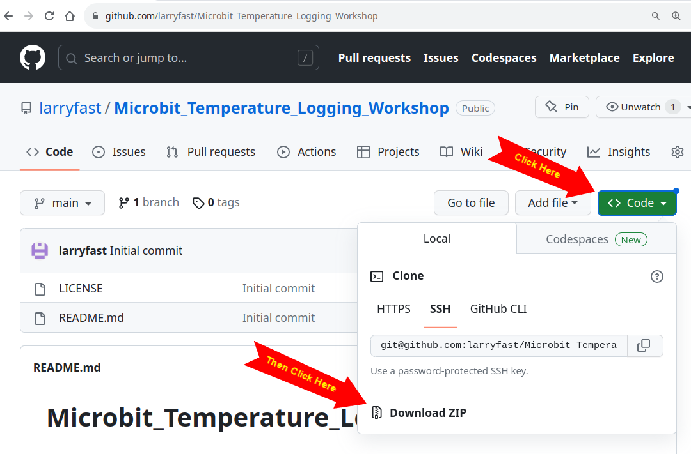
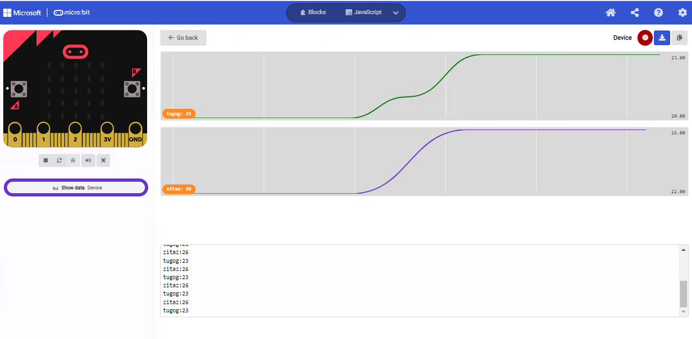
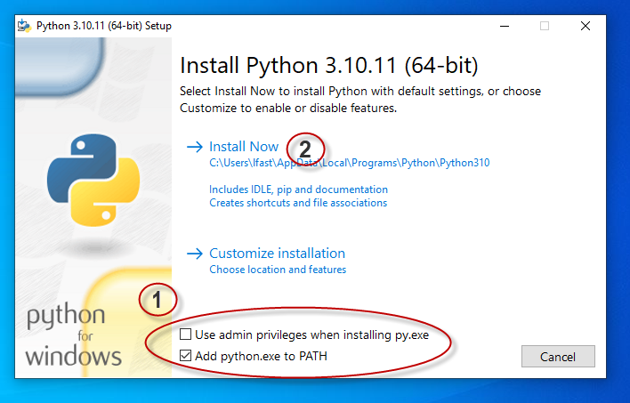

# Microbit_Temperature_Logging_Workshop
### User Setup instructions for Temperature Logging Workshop
If you're new to this project, check out the [Video Introduction](https://drive.google.com/file/d/1mYZ_2l180Y-lkBSsZB7TyOlIXvZIsM0o/view?usp=sharing). This workshop is suitable for experienced Microbit users who want to try something more challenging. 

The remainder of this README are detailed instructions for downloading and running the project.

TODO: This documentation only covers setup and operation. It does not include a specific experiment design. First suggestion is wrapping Microbits in different kinds of insulation. Then compare cooling or warming rates.

####  Table of Contents
- [Setup Instructions Video](#Setup-Instructions-Video)
- [Project Requirements](#Project-Requirements)
- [Download the project code to a folder](#Download-the-project-code-to-a-folder)
- [Program your Microbits](#Program-your-microbits)
- [Install Python](#Install-Python)
- [Install the Python Packages used by the code](#Install-the-Python-Packages-used-by-the-code)
- [Configure the spreadsheet for your computer](#configure-the-spreadsheet-for-your-computer)
- [Start your engines!](#start-your-engines)

### Setup Instructions Video
The instructions below are also available as a video.
[Setup Instructions Video](https://drive.google.com/file/d/1mYZ_2l180Y-lkBSsZB7TyOlIXvZIsM0o/view?usp=sharing)

### Project Requirements
* Currently this project runs on Windows only. As soon as someone asks, we can set it up to run on Linux and Mac.
- PC running Windows
- Excel (future: Libre Calc)
- USB port for connecting to Microbits - will not work with Microbits connected via Wifi
- Microbits! (of course)
	- At least one Microbit must be version 2.0 or higher
	- [finding your Microbit version number](https://support.microbit.org/support/solutions/articles/19000119162-how-to-identify-the-version-number-of-your-micro-bit#:~:text=20%2C%20V2%2C%20V1.,beneath%20the%20black%20silkscreen%20paint.)

### Download the project code to a folder

In a browser, open the Github project repository
https://github.com/larryfast/Microbit_Temperature_Logging_Workshop

Download a ZIP file of all the code

Pick a location on your computer. Unzip the project files into that folder.

### Program your microbits
The project folder contains 2 .hex files
- microbit-radio2serial.hex 
	- Program one Microbit with this code
- microbit-2s-TemperatureSender.hex
	- Program this code into as many Microbits as desired

If preferred you can use the microbit editor to review the code and program your microbits. Here are the Microbit Project links
- https://makecode.microbit.org/_AEkKMPWjEKss = radio2serial
- https://makecode.microbit.org/_P7JURDf6vU8J = Temperature Sender 2s

#### Optional: Test your microbits 
You can test the microbits without the rest of the project code
- Connect the radio2serial Microbit to your USB port
- Open Makecode (Microbit Editor)
- Connect your device  (3-dot menu beside Download, lower right)
- Power up at least one Temperature Sender
	- Each of these will read the Temperature every 2 seconds and send the result to the radio2serial Microbit
- Display the output graphically

Note: The funky strings you see (zitaz & tugog in this example) are the Microbit IDs. The IDs are used to uniquely identify each data source.

### Install Python
Download the Python installer from here:
Recommended version: [Windows Installer (64-bit)](https://www.python.org/ftp/python/3.10.11/python-3.10.11-amd64.exe)

NOTE: When running the installer uncheck run as Administrator & check update path.

### Install the Python Packages used by the code
The project uses Python code to collect the Temperature readings from radio2serial Microbit and relay them to the spreadsheet. It needs a couple Python packages that are not part of the standard release.

The video introduction has a segment on installing these packages. 
- Open a Powershell window in project folder
- Run this command:   **.\**install_python_packages.bat

### Configure the live_data.xlsm spreadsheet for your computer
The short story is, run the **connect_external_csv** Excel Macro. It adjusts the spreadsheet to work on your PC. 
- **The video shows you how to run the following steps.**
- Open the live_data.xlsm spreadsheet in Excel
- Enable Editing
- Close the warning about running Macros - no changes required
- Enable the Developer Menu (detailed steps are in the video)
- Open Developer Tab
- Select Macros => Workbook Macros
- Run the **connect_external_csv** macro
- Exit Excel
- Save a copy of your configured Excel file

## Start your engines!
Time to start recording Temperatures! The remaining steps power up all the bits and get them talking to each other.

### Connect the Microbit programmed with radio2serial.hex to USB port

### Delete file: ubit_live_data.csv

### Run start_serial2csv.bat from Powershell
The video introduction has a segment on starting the Python program.
- Open a Powershell window in project folder
- Run this command:   .\start_serial2csv.bat

### Open spreadsheet in Excel

### Power up one or more Temperature sensing Microbits

### Spreadsheet should show updated Temperatures every minute
If you're in a hurry... 
- open the Data Tab
- Click Refresh

## Shutting Down
- Before closing excel, run the Backup Data Macro. See video for details
	- Give your test results sheet a useful name. Eg. ColdTests-05-22
- close Excel
- save a copy of the spreadsheet
- close the powershell window

## Epilogue
After collecting Temperature data from a set of Microbits, you can examine that data in other ways. 
- Caution: do not use the live_data sheet. When running excel, this sheet could recieve new data, erasing the existing data.
- Use the Backup sheet for analysis (eg. ColdTests-05-22)
- Some options include
	- Transfer the data to a Google Sheet so everyone can access it
	- Compare the speed of cooling for different kinds of insulation
	- Students can extract the Temperatures from their Microbit and graph their own data
